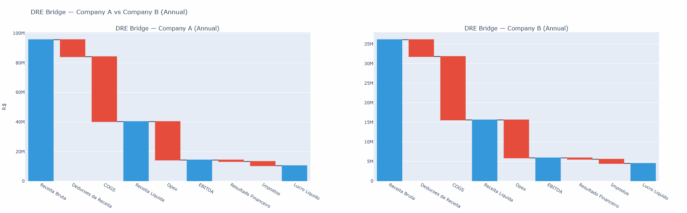
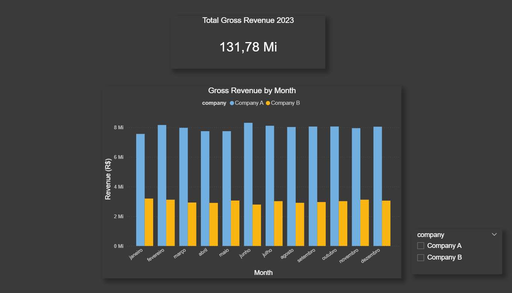

# Financial Performance Analyzer — DRE Variance Analysis

Most financial analysis starts with a flat export from an ERP system — thousands of transaction
rows with account codes, cost centers, and amounts that mean nothing on their own.

This project simulates that exact starting point and builds a full pipeline to transform it into
actionable financial reporting: a structured DRE (Income Statement), margin analysis, variance
tracking, and an interactive Power BI dashboard.

The goal is to demonstrate the end-to-end workflow that FP&A and data teams run every month
to track company performance — from raw transactional data to executive-level dashboards.

---

## Demo

### Plotly Charts


### Power BI Dashboard


---

## Why This Matters

In practice, finance teams receive ERP exports and need to answer questions like:

- Where is the company losing margin month over month?
- Which cost center is driving the increase in Opex?
- How does Company A compare to Company B in profitability?

Answering these manually in Excel is slow and error-prone. This project automates the entire
workflow — from loading raw transactions into a database, to building the DRE logic in Python,
to surfacing the results in a Power BI dashboard that any stakeholder can use.

---

## Architecture

```
ERP-style Transactions (synthetic)
            │
            ▼
    PostgreSQL Database          ← docker-compose (financial_db)
    (transactions table)
            │  SQL query by period
            ▼
    src/extract.py           →   data/raw/transactions.parquet
            │
            ▼
    src/transform.py         →   data/processed/dre_metrics.parquet
      - build_dre()               DRE lines, subtotals
      - calculate_margins()       Gross margin, EBITDA margin, Net margin
      - calculate_variance()      MoM and YoY variance
            │
            ├──────────────────→  src/visualize.py
            │                     Plotly charts (HTML)
            │                     - Margins over time
            │                     - Gross revenue by month
            │                     - DRE waterfall bridge
            │
            └──────────────────→  Power BI Desktop
                                  Connected directly to PostgreSQL
                                  - Revenue Overview
                                  - Margins & Profitability
                                  - Cost Breakdown by DRE line and cost center
```

---

## Power BI Dashboard

The dashboard connects directly to PostgreSQL via the Npgsql driver and uses DAX measures
to calculate margins dynamically — so every slicer interaction recomputes the metrics in real time.

**Revenue Overview**
Monthly gross revenue comparison between Company A and Company B. Includes a company slicer
and a total revenue card. Shows revenue scale differences and monthly distribution patterns.

**Margins & Profitability**
Line chart tracking Gross Margin % and EBITDA Margin % across 12 months, with a detailed
table showing absolute values per month. Useful for identifying which months underperformed
and how the two companies compare in profitability.

**Cost Breakdown**
Bar charts showing total costs by DRE line (COGS, Opex, Deductions) and by cost center.
Retail operations represent the largest cost driver, consistent with the revenue weight
of the Retail business unit (50% of total revenue).

DAX measures used:
- `Receita Bruta` — filters transactions where dre_line = "Receita Bruta"
- `Lucro Bruto` — aggregates Receita Bruta + Deducoes + COGS
- `EBITDA` — aggregates through Opex
- `Gross Margin %` — DIVIDE(Lucro Bruto, Receita Bruta)
- `EBITDA Margin %` — DIVIDE(EBITDA, Receita Bruta)
- `Total Costs (Abs)` — ABS of cost lines for cleaner visualization

---

## Data Source

Financial structures were calibrated using real income statement data from major public companies.

Dataset reference:
[Financial Statements of Major Companies 2009–2023](https://www.kaggle.com/datasets/rish59/financial-statements-of-major-companies2009-2023)

Margin proportions by industry category (IT: gross margin ~57%, EBITDA ~36% / FOOD: gross
margin ~45%, EBITDA ~42%) were used to set the account proportions in the synthetic generator.
Transaction-level detail — companies, business units, cost centers — was generated synthetically,
as ERP data is always proprietary in real environments.

---

## Project Structure

```
financial-performance-analyzer/
├── data/
│   ├── raw/                    # Output of extract.py (parquet)
│   └── processed/              # Output of transform.py (parquet)
├── notebooks/                  # Exploratory analysis
├── reports/
│   ├── demo/                   # GIFs for README
│   └── figures/                # Plotly charts (HTML)
├── scripts/
│   └── generate_data.py        # Synthetic data generator
├── sql/
│   └── 01_schema.sql           # Database schema
├── src/
│   ├── extract.py              # PostgreSQL → parquet
│   ├── transform.py            # DRE logic, margins, variance
│   └── visualize.py            # Plotly charts
├── .env.example
├── docker-compose.yml
└── requirements.txt
```

---

## How to Run

**1. Clone and install dependencies**

```bash
git clone https://github.com/thiagofsdata-collab/financial-performance-analyzer.git
cd financial-performance-analyzer

python -m venv .venv
.venv\Scripts\activate          # Mac/Linux: source .venv/bin/activate
pip install pandas numpy sqlalchemy psycopg2-binary plotly python-dotenv faker pyarrow
```

**2. Configure environment**

```bash
cp .env.example .env
```

**3. Start PostgreSQL**

```bash
docker-compose up -d
```

**4. Generate synthetic data and load into Postgres**

```bash
python scripts/generate_data.py
```

**5. Run the pipeline**

```bash
python -m src.extract
python -m src.transform
python -m src.visualize
```

Plotly charts will be saved to `reports/figures/` as interactive HTML files.

**6. Power BI**

Install the Npgsql driver, open Power BI Desktop, and connect to `localhost:5432 / financial_db`
using the credentials from your `.env` file.

---

## Technical Decisions

**Amount sign convention**
Revenue is positive, costs and deductions are negative. This allows `SUM(amount)` to produce
correct DRE totals without conditional logic in queries or transformations.

**Parquet format**
Intermediate datasets are stored in Parquet — columnar, compressed, and significantly faster
to read than CSV for analytical workloads.

**SQLAlchemy over psycopg2**
Provides an abstraction layer with cleaner query parameterization and native Pandas integration
via `pd.read_sql`. More maintainable than raw cursor operations.

**DAX over pre-computed margins**
Margins in Power BI are calculated via DAX measures rather than imported from the processed
parquet. This allows slicers to recompute metrics dynamically based on user filters.

**YoY returns NaN**
Expected — the dataset only covers 2023. A second year of transactions would populate YoY
metrics automatically without any changes to the pipeline.

---

## Technologies

Python, Pandas, NumPy, PostgreSQL, SQLAlchemy, Plotly, Docker, Parquet, Power BI, DAX